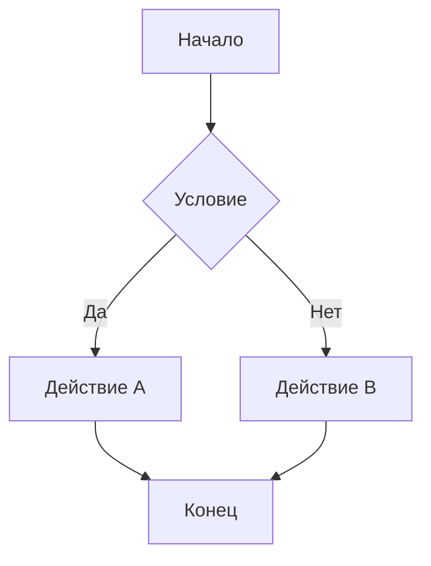

# Поддерживаемые фичи редактора

## YFM Notes (работает в wysiwyg)

привет



Информационная заметка. Поддерживается в wysiwyg-режиме через `preset: 'yfm'`.





Подсказка. Это полезный совет.





Предупреждение. Будьте осторожны.





Критическое предупреждение!



## YFM Tabs (работает в wysiwyg)



- Tab A

  Содержимое первой вкладки.

- Tab B

  Содержимое второй вкладки.

- Tab C

  Содержимое третьей вкладки.



## YFM Cut / Spoiler (работает в wysiwyg)



Этот текст скрыт под спойлером. Нажмите чтобы раскрыть.



## LaTeX / Math (работает в wysiwyg)

Inline формула: $E = mc^2$

Блочная формула:

$$\int_{-\infty}^{\infty} e^{-x^2} dx = \sqrt{\pi}
$$

## Mermaid (работает в wysiwyg)

## Include (только markup-режим)

Инклюды разрешаются во время сборки, не в редакторе.
В wysiwyg-режиме показывается как текст со ссылкой.

\{% include [level1-include](level1/includes/level1-include.md) %\}

## Page Constructor (только markup-режим)

Блок `page-constructor` отображается как текст в wysiwyg-режиме.
Для редактирования используйте markup-режим.

\::: page-constructor
blocks:

- type: 'header-block'
  title: 'Заголовок страницы'
  description: 'Описание страницы'
  \:::

## OpenAPI (только markup-режим)

\::: openapi
path: ./openapi.yaml
\:::